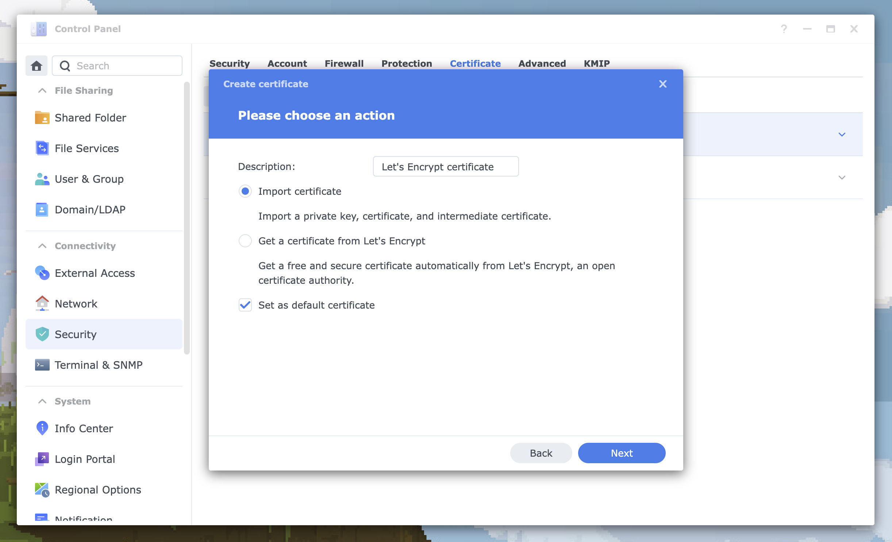

# Manage certificates with Certbot and Docker on a Synology NAS

This guide explains how to use [Certbot](https://certbot.eff.org) to obtain SSL/TLS certificates from [Let's Encrypt](https://letsencrypt.org), apply certificates to your Synology NAS, and automate renewals with custom scripts.

## Overview
The following steps use Docker to run Certbot, which completes the [DNS-01 challenge](https://letsencrypt.org/docs/challenge-types/#dns-01-challenge), validating a domain you own against a text record created via the Cloudflare API and then downloading certificates. This method is ideal for home servers, since you don't need to expose your server to the web. 

## Before you start

Make sure you have:

* A Synology NAS with DiskStation Manager 7 or later installed.
* SSH acess with permission to run `sudo` and Docker commands from a terminal emulator.
* A registered domain using Cloudflare for DNS management.
* A Cloudflare API token with **Edit zone DNS** permissions, as described in [Create API token](https://developers.cloudflare.com/fundamentals/api/get-started/create-token/) in the Cloudflare documentation.
* A text editor for editing configuration files.

## Configure Certbot

On your NAS, create directories for Certbot. Then, add your Cloudflare API token to the Certbot configuration file. 

> **Note**: These steps use `sudo` to create `root`-owned folders with `700` permissions. You can use less restrictive permissions for easier access, but Certbot may show warnings if you change ownership.

1. Create Certbot directories:

    ```bash
    sudo mkdir -p /volume1/docker/certbot/{logs,lib_letsencrypt,etc_letsencrypt}
    ```

1. Create the Certbot configuration file:

    ```bash
    sudo touch /volume1/docker/certbot/lib_letsencrypt/cloudflare.ini
    ```

1. Add your Cloudflare API token:

    ```bash
    echo "# Cloudflare API token used by Certbot
    dns_cloudflare_api_token = your-cloudflare-api-token" | \
    sudo tee /volume2/docker/certbot/lib_letsencrypt/cloudflare.ini > /dev/null
    ```
## Run Certbot with Docker

Use the following Docker Run command to launch a temporary container which runs Certbot, mounts directories, and takes the DNS-01 challenge. 

> **Tip**: The following example obtains a [wildcard certificate](https://knowledge.digicert.com/general-information/what-is-a-wildcard-certificate), but you can get another type, such a single-domain certificate. To do this, replace `*.mydomain.com` with `mydomain.com`.

```bash
sudo docker run -v /volume1/docker/certbot/etc_letsencrypt:/etc/letsencrypt \
        -v /volume1/docker/certbot/lib_letsencrypt:/var/lib/letsencrypt \
        -v /volume1/docker/certbot/logs:/var/log/letsencrypt \
    --rm \
        --cap-drop=all \
        certbot/dns-cloudflare:latest \
        certonly \
        --cert-name mydomain.com \
        --key-type rsa \
        --dns-cloudflare \
        --dns-cloudflare-credentials /var/lib/letsencrypt/cloudflare.ini \
        --dns-cloudflare-propagation-seconds 30 \
        --server https://acme-v02.api.letsencrypt.org/directory \
        --non-interactive \
        --email email@example.com \
        --agree-tos \
        -d *.mydomain.com
```
Certbot downloads SSL/TLS certificates to your NAS:

```txt
Successfully received certificate.
Certificate is saved at: /etc/letsencrypt/live/mydomain.com/fullchain.pem
Key is saved at:         /etc/letsencrypt/live/mydomain.com/privkey.pem
This certificate expires on 2025-02-16.
These files will be updated when the certificate renews.
NEXT STEPS:
- The certificate will need to be renewed before it expires. Certbot can automatically renew the certificate in the background, but you may need to take steps to enable that functionality. See https://certbot.org/renewal-setup for instructions.

- - - - - - - - - - - - - - - - - - - - - - - - - - - - - - - - - - - - - - - -
If you like Certbot, please consider supporting our work by:
 * Donating to ISRG / Let's Encrypt:   https://letsencrypt.org/donate
 * Donating to EFF:                    https://eff.org/donate-le
- - - - - - - - - - - - - - - - - - - - - - - - - - - - - - - - - - - - - - - -
```
## Install the new certificate

In Synology DiskStation Manager, download the certificate to your computer and then install it on your NAS. Once the certificate is installed, you'll use scheduled tasks to automate renewals.

1. In Synology DiskStation Manager, go to `.../docker/certbot/etc_letsencrypt/live` and download the folder named after your domain.

    

1. In Synology DiskStation Manager, go to **Control Panel** > **Security** > **Certificate**.

1. In the **Certificate** tab, click **Add**.

    

1. In the **Create Certificate** dialog that appears, under **Please choose an action**, select **Add a new certificate** and click **Next**. 

1. In the **Create Certificate** dialog, select **Import certificate** and **Set as default certificate**. Then, click **Next**.

    

1. In the **Create Certificate** dialog under **Import Certificate Files**, click **Browse** and choose the following files from the folder you downloaded:

    * Private Key — `privkey.pem`
    * Certificate — `cert.pem`
    * Intermediate Certificate — `fullchain.pem` 

1. In the **Create Certificate** dialog, click **OK**. 

    Synology DiskStation Manager applies the certificate and restarts affected services.

## Configure the certificate check script

Download the certificate check script and run it once to create a configuration file. Then, add your certificate details to the file.

1. Download the script and make it executable:

    ```bash
    sudo wget -O check_certs.sh https://raw.githubusercontent.com/telnetdoogie/synology-scripts/main/check_certs.sh && \
    sudo chmod +x check_certs.sh
    ```
2. Run the script to create the configuration file:

    ```bash
    sudo ./check_certs.sh
    ```

3. Open the newly created "`cert_config.json` file in a text editor and add your certificate file path in `cert_path` for the section where you see your certificate's common name ( the update script should have populated these CN names for you ): 

    ```json
    {
      "config": [
        {
          "cn": "*.mydomain.com",
          "cert_path": "/volume1/docker/certbot/etc_letsencrypt/live/mydomain.com"
        }
      ]
    }
    ```
## (Optional) Test the certificate check script

To test the certificate check script before adding it to a scheduled task, run it in **check-only** mode to see which certificates need updates and then in **update mode** to install new certificates.

> **Tip**: Use flags to do a dry run, skip your VPN server, or force updates:
>
> | Flag           | Description                                                                                                                                                     |
> |----------------|-----------------------------------------------------------------------------------------------------------------------------------------------------------------|
> | `--novpnregen` | Skip VPN certificates used by [Synology VPN Server](https://www.synology.com/en-us/dsm/packages/VPNCenter) so you do not need to regenerate VPN client files.   |
> | `--dry-run`    | Troubleshoot by running the script without updating certificates or restarting applications.                                                                    |
> | `--force`      | Apply new certificates even if the current ones are not near expiration or mismatched.                                                                          |

1. Check the current certificates on your NAS:

    ```bash
    sudo ./check_certs.sh
    ```

    The script lists installed certificates color-coded in **red** or **green**. Red indicates a mismatch with the certificates you obtained with Certbot. 

2. Install new certificates:

    ```bash
    sudo ./check_certs.sh --update
    ```

    The script copies new certificates to your live certificate folders and restarts corresponding Synology services. If certificates don't expire for more than 60 days, no changes are made.

## Schedule certificate renewals

Let's Encrypt certificates expire every 90 days, but you can automate renewals with the Synology Task Scheduler. To do this, schedule two tasks: one to renew your certificates and another to install them using `check_certs.sh`. 

1. In Synology DiskStation Manager, go to **Control Panel** > **Task Scheduler**.

1. Using **Create** > **Scheduled Task** > **User Defined Script**, add two repeating tasks which run as `root` one hour apart.

    

    For each task, in the **Task Settings** tab under **Run Command**, enter the following.

    a. For the script to **renew certificates** in the Certbot folder:

    ```bash
    /bin/bash
    sudo docker run -v /volume1/docker/certbot/etc_letsencrypt:/etc/letsencrypt \
        -v /volume1/docker/certbot/lib_letsencrypt:/var/lib/letsencrypt \
        -v /volume1/docker/certbot/logs:/var/log/letsencrypt \
        --rm \
        --cap-drop=all \
        certbot/dns-cloudflare:latest \
        renew
    ```
    b. For the script to **install certificates** on your NAS:

    ```bash
    cd /path/to/script # Change into the script directory where ran the script and where cert_config.json resides 
    ./check_certs.sh --update
    ```


## See also

* [Create API token | Cloudflare Docs](https://developers.cloudflare.com/fundamentals/api/get-started/create-token/)
* [Running containers | Docker Docs](https://docs.docker.com/engine/containers/run/#runtime-privilege-and-linux-capabilities)
* [Tips for creating tasks and writing scripts in Task Scheduler | Synology Knowledge Center](https://kb.synology.com/en-us/DSM/tutorial/common_mistake_in_task_scheduler_script)


